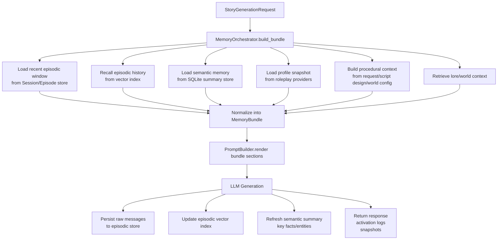

# Plan_2026-03-15_记忆架构重构与迁移方案

## 1. 背景与目标

当前项目已经具备记忆能力雏形，但边界混乱：

- `story_rag_service/services/conversation_history_manager.py` 同时承担原始历史向量化、历史检索、检索重排。
- `story_rag_service/services/summary_memory_manager.py` 实际上已经是 semantic memory 的雏形，但仍以“摘要管理器”语义存在。
- `story_rag_service/services/story_generation/context_helpers.py` 将 `profile`、`procedural controls`、消息持久化工具混放在一起。
- `story_rag_service/services/story_generator.py`、`application/story_generation/retrieval.py`、`services/story_generation/prompt_builder.py` 同时理解 memory source、检索流程、prompt 注入，职责重叠。

这会导致后续一旦继续增加记忆类型、状态抽取、失效机制或更复杂检索，代码复杂度会快速失控。

本方案目标：

1. 将记忆系统重构为职责清晰的四层模型。
2. 用统一 `MemoryBundle` / `MemoryOrchestrator` 收敛读路径。
3. 用统一 `memory_update_service` 收敛生成后更新路径。
4. 在不引入重型外部 memory framework 的前提下，最大化复用现有 SQLite、vector store、roleplay/session 结构。
5. 为后续进一步细粒度事实记忆、生命周期管理、检索增强预留清晰边界。

---

## 2. 设计原则

### 2.1 单一职责原则

- **存储层**只负责持久化与读取。
- **检索层**只负责召回。
- **编排层**只负责聚合与预算控制。
- **提示构建层**只负责把标准化 memory 渲染成 prompt。
- **更新层**只负责生成后的 memory 写入与合并。

### 2.2 迁移原则

- 小步可回滚。
- 先统一读路径，再统一写路径，最后再考虑 schema 收敛。
- 首期不追求一次性建完“终极记忆系统”。
- vector store 只能是派生检索索引，不能成为真相源。

---

## 3. 目标架构：四层记忆模型

### 3.1 Episodic Memory（经历记忆）

表示“发生过什么”。

职责：
- 持久化原始会话消息/事件。
- 提供 recent window。
- 提供历史 episode 召回候选。
- 不负责摘要合并。
- 不负责 profile 读取。
- 不负责 prompt 文本拼装。

当前映射：
- `story_session_messages`
- `ConversationHistoryManager.add_message_to_rag(...)`
- `ConversationHistoryManager.search_relevant_history(...)`

### 3.2 Semantic Memory（事实记忆）

表示“从经历中沉淀出的事实”。

职责：
- 维护摘要、关键事实、实体状态。
- 提供 session/world 范围的事实快照。
- 负责合并、去重、长度控制。
- 不负责 prompt 渲染。

当前映射：
- `SummaryMemoryManager`
- `summary_helpers.build_summary_snapshot(...)`
- `generate_llm_summary(...)`

### 3.3 Profile Memory（画像记忆）

表示“我是谁 / 角色是谁 / 稳定状态是什么”。

职责：
- persona
- character card
- story state
- 稳定角色画像/身份信息
- 不承载本轮临时控制项

当前映射：
- `load_roleplay_profile(...)`
- `models/roleplay.py`
- `RoleplayProfileManager`

### 3.4 Procedural Memory（规则记忆）

表示“这一轮必须按什么规则生成”。

职责：
- dialogue controls
- author’s note / instruction
- script design guidance
- active stage / active event constraints
- mode / focus instruction
- 原则上不作为长期语义记忆持久化

当前映射：
- `StoryGenerationRequest` 中控制参数
- `load_script_design_context(...)`
- `dialogue_controls`
- 世界/脚本设计中的生成约束

---

## 4. 最小数据模型设计

目标不是一开始就大改 schema，而是先定义清晰的最小模型，让现有表和服务能被重新解释并逐步收敛。

### 4.1 EpisodeRecord

```python
EpisodeRecord = {
  "session_id": str,
  "world_id": str | None,
  "role": "user" | "assistant" | "system",
  "content": str,
  "turn_number": int,
  "created_at": str,
  "metadata": dict,
}
```

说明：
- `story_session_messages` 作为 canonical source。
- vector store 中的 `conversation_history` 只作为 retrieval index。

### 4.2 SemanticMemoryRecord

```python
SemanticMemoryRecord = {
  "session_id": str,
  "world_id": str | None,
  "summary_text": str,
  "key_facts": list[str],
  "entities": dict[str, list[str]],
  "last_turn": int,
  "updated_at": str,
}
```

说明：
- 数据来源为 `conversation_summaries`。
- 当前 `SummaryMemoryManager` 继续作为兼容实现核心。

### 4.3 ProfileSnapshot

```python
ProfileSnapshot = {
  "persona": dict | None,
  "character_card": dict | None,
  "story_state": dict | None,
}
```

说明：
- 首期不强制新建表。
- 先做标准 DTO，统一读取边界。

### 4.4 ProceduralContext

```python
ProceduralContext = {
  "authors_note": str | None,
  "dialogue_controls": dict,
  "script_guidance": dict,
  "mode": str,
  "instruction": str | None,
  "focus_instruction": str | None,
  "focus_label": str | None,
}
```

说明：
- 首期不持久化。
- 作为 request-scoped normalized context。

### 4.5 MemoryBundle

统一读路径的标准对象：

```python
MemoryBundle = {
  "episodic": {
    "recent_messages": [...],
    "recalled_episodes": [...]
  },
  "semantic": {
    "summary_text": str,
    "key_facts": [...],
    "entities": {...}
  },
  "profile": {
    "persona": {...} | None,
    "character_card": {...} | None,
    "story_state": {...} | None
  },
  "procedural": {
    "authors_note": str | None,
    "dialogue_controls": {...},
    "script_guidance": {...},
    "mode": str,
    "instruction": str | None,
    "focus_instruction": str | None,
    "focus_label": str | None
  },
  "world": {
    "world_id": str | None,
    "retrieved_lore": [...]
  },
  "meta": {
    "session_id": str,
    "activation_logs": [...]
  }
}
```

---

## 5. 检索流程图



---

## 6. 单一职责边界设计

### 6.1 Storage / Provider 层

#### episodic_store
职责：
- 从 SQLite 读写原始会话消息。
- 提供 recent window。
- 不负责语义检索。

#### episodic_index
职责：
- 管理 episode 的向量检索索引。
- 提供召回 API。
- 不负责原始数据真相存储。

#### semantic_store
职责：
- 管理 `summary_text / key_facts / entities`。
- 提供 upsert / merge / read。
- 不负责 prompt 渲染。

#### profile_provider
职责：
- 从 roleplay manager 聚合 persona / story_state / character data。
- 输出 `ProfileSnapshot`。

#### procedural_provider
职责：
- 从 request + script design + world config 生成 `ProceduralContext`。
- 不做长期持久化。

### 6.2 Application / Orchestration 层

#### memory_orchestrator
职责：
- 统一读取各类 memory source。
- 控制各 layer 的预算与装配顺序。
- 记录 activation logs。
- 构造 `MemoryBundle`。
- 不负责 prompt 构建。
- 不负责生成文本。

#### memory_update_service
职责：
- 统一处理生成后的 memory 更新。
- raw message 持久化。
- episodic index 更新。
- semantic summary 更新。
- 不参与 prompt 构建。

### 6.3 Presentation / Prompt 层

#### prompt_builder
职责：
- 只接收 `MemoryBundle`。
- 渲染 prompt sections。
- 执行 token budget trim。
- 不直接访问底层 manager/repository。

---

## 7. 建议修改 / 新增的关键文件

### 7.1 优先修改的现有文件

- `story_rag_service/services/story_generator.py`
  - 从“memory 拼装中心”降级为“生成流程协调者”。
- `story_rag_service/application/story_generation/retrieval.py`
  - 收缩为 world/lore + episodic recall 子流程。
- `story_rag_service/services/story_generation/prompt_builder.py`
  - 改为只消费标准化 `MemoryBundle`。
- `story_rag_service/services/story_generation/context_helpers.py`
  - 拆出 profile/procedural provider 边界。
- `story_rag_service/services/summary_memory_manager.py`
  - 保留兼容实现，但语义上升级为 semantic store 核心。
- `story_rag_service/services/conversation_history_manager.py`
  - 从“历史总管”收缩为 episodic index / retrieval 角色。
- `story_rag_service/services/session_manager.py`
  - 明确只负责 session 生命周期与消息恢复。

### 7.2 建议新增的模块

首期先新增 3 个文件，避免过拆：

- `story_rag_service/application/memory/models.py`
- `story_rag_service/application/memory/orchestrator.py`
- `story_rag_service/application/memory/update_service.py`

后续边界清晰后，再视情况细分：

- `application/memory/episodic.py`
- `application/memory/semantic.py`
- `application/memory/profile.py`
- `application/memory/procedural.py`

---

## 8. 迁移步骤设计

### Phase 0：命名收敛与边界定义（不改行为）

目标：
- 定义四层记忆术语与 DTO。
- 定义 `MemoryBundle`。
- 明确当前实现映射关系：
  - history -> episodic
  - summary -> semantic
  - roleplay/story_state -> profile
  - dialogue/script controls -> procedural

动作：
- 新增 `application/memory/models.py`
- 写适配层，不改现有路由与生成输出。
- 给关键旧模块补边界注释/命名说明。

验收：
- 功能行为不变。
- 生成链路仍可跑通。
- 只是新增标准化模型与命名。

### Phase 1：统一读路径

目标：
- 新增 `MemoryOrchestrator.build_bundle()`。
- `StoryGenerator.generate_story()` 与 streaming 路径只从 orchestrator 取 memory。
- `prompt_builder` 改为只认 bundle 或 bundle-compatible sections。

动作：
- 从 `StoryGenerator` 搬出 summary/profile/history/lore 读取逻辑。
- 从 `context_helpers` 中拆出 profile/procedural provider。
- 把 `retrieval.py` 明确为 episodic/world retrieval 子流程。

验收：
- `StoryGenerator` 不再直接拼装多个 memory source。
- `prompt_builder` 不直接访问 manager/repository。
- 正常生成、流式生成、调试输出保持兼容。

### Phase 2：统一生成后更新路径

目标：
- 将消息持久化、向量索引更新、semantic summary 更新整合到 `memory_update_service`。
- 明确：
  - SQLite messages = truth source
  - vector store = derived retrieval index

动作：
- 收编 `persist_message_to_db(...)`
- 收编 `add_message_to_rag(...)`
- 收编 `maybe_update_summary_memory(...)`
- 收编 `async_maybe_update_summary_memory(...)`
- 统一 post-generation update sequence

验收：
- 回滚 / 重生成 / 恢复 session 不出现明显错位。
- summary 仍正常更新。
- 历史召回与消息恢复一致。

### Phase 3：拆分 profile / procedural 污染

目标：
- `load_roleplay_profile()` 拆为：
  - profile snapshot provider
  - procedural controls provider
- script design guidance 进入 procedural layer，而不是继续混在 roleplay/profile dict 中。

动作：
- 把 `dialogue_controls`、`instruction`、`script design guidance` 独立建模。
- prompt sections 改为按 layer 渲染。

验收：
- procedural constraints 仍正确注入 prompt。
- 不再污染 `ProfileSnapshot`。
- profile 结构更稳定，便于后续持久化或缓存。

### Phase 4：可选 schema 收敛与更细粒度事实化

前提：前 3 阶段稳定运行后。

可选动作：
- 为 semantic memory 拆更细粒度 fact records。
- 引入 memory lifecycle 字段：`active / superseded / resolved`。
- 为 episodic recall 增加 event abstraction。

首期不建议：
- 全量历史回填。
- 一次性重做全部 embedding。
- 直接引入图数据库 / 知识图谱层。

---

## 9. 风险与控制策略

### 9.1 最大风险

- 把 `summary memory` 继续做成“万能记忆桶”。
- 把 procedural 当长期记忆持久化，污染长期状态。
- 把 vector store 当真相源，导致 session 恢复与召回错位。
- prompt_builder 继续直接接触底层 manager，导致分层失败。

### 9.2 控制策略

- 先统一读路径，再统一写路径，最后清理命名与 schema。
- 所有新边界先做兼容层，避免一次性替换。
- 将 `MemoryBundle` 作为唯一 prompt 输入契约。
- 给 activation logs 增加：
  - `memory_layer`
  - `source`
  - `selected_count`
  - `trimmed_count`
  - `update_performed`
  - `last_turn_seen`

---

## 10. 验证方案

### 10.1 结构验证

检查是否满足：
- `StoryGenerator` 不直接访问多个 memory source 实现。
- `prompt_builder` 不直接访问 manager/repository。
- 新增 memory type 时优先修改 orchestrator/provider，不触碰 prompt 层契约。

### 10.2 行为验证

重点验证场景：
- 长会话继续生成：recent window、summary 更新、history 召回正常。
- 服务重启恢复 session：raw messages / semantic summary / profile state 不丢。
- roleplay + script design 混合场景：procedural constraints 仍正确注入。
- regenerate / rollback：episodic raw history 与 semantic summary 不明显错位。

### 10.3 回归与运行验证

- 运行后端服务，验证 `/api/v2/story/generate`。
- 验证 streaming / non-streaming 路径。
- 检查 activation logs 与 retrieved contexts 输出。
- 对照 `story_rag_service/docs/OBSERVABILITY.md` 扩展 memory 观测字段。

---

## 11. 建议的实施顺序

推荐严格按以下顺序推进：

1. 定义 `MemoryBundle` 和四层 DTO。
2. 把现有读取逻辑全部收敛到 orchestrator。
3. 改 `prompt_builder` 只消费 bundle。
4. 再统一 post-generation update。
5. 最后清理命名和存储边界。

核心思路：

**先统一读，再统一写，最后再美化存储。**

这是最稳妥、最符合单一职责原则、同时对现有代码冲击最小的迁移路线。
