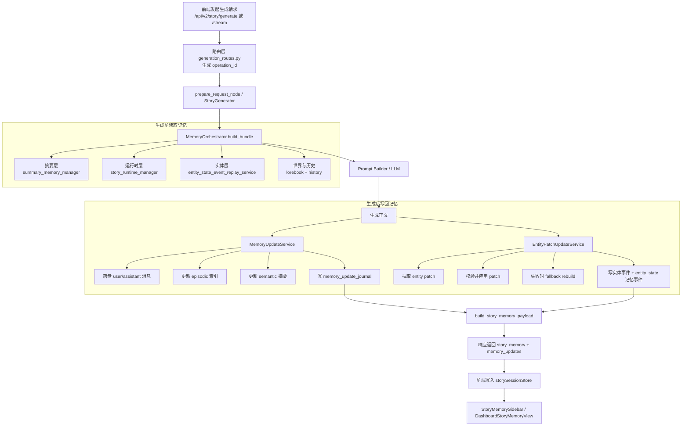
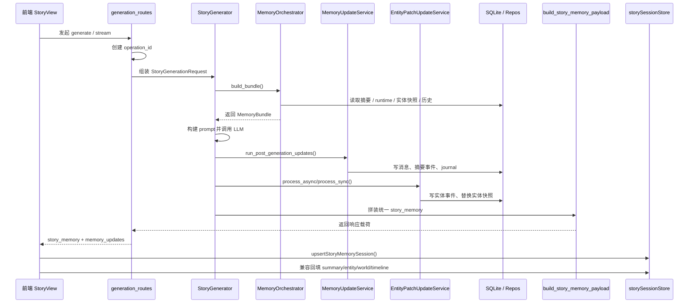

# Plan_2026-04-15_故事记忆系统运行机制说明

## 1. 文档目标

本文档面向项目维护者，详细说明本项目“故事记忆系统”当前是如何运行的，重点回答四个问题：

1. 一次故事生成请求，记忆是在什么时候被读取和写回的。
2. `story_memory` 为什么能同时承载摘要、运行时、实体状态和时间线。
3. `memory_update_journal`、实体 patch 事件、`operation_id` 在整条链路中分别起什么作用。
4. 前端是如何把后端返回的 `story_memory` 落到本地 store，并驱动侧栏与管理台页面的。

本文依据当前代码现状编写，不以旧方案文档为准。

---

## 2. 先看整体：故事记忆系统到底在做什么

这个系统本质上做两件事：

1. 在生成前，把“当前故事上下文”组织成一个可供模型消费的记忆包。
2. 在生成后，把“这次生成带来的变化”写回系统，并聚合成一个统一的 `story_memory` 快照返回给前端。

它不是单一的“摘要系统”，而是一个统一读写层，覆盖五个视图：

1. `operation`：这一次记忆操作的元信息。
2. `semantic`：语义摘要层。
3. `runtime`：剧本运行时状态层。
4. `entity`：角色实体状态层。
5. `timeline`：本轮及历史记忆事件时间线。

可以把它理解为：

- `MemoryOrchestrator` 负责“生成前取记忆”。
- `MemoryUpdateService` 和 `EntityPatchUpdateService` 负责“生成后写记忆”。
- `build_story_memory_payload(...)` 负责“把各层结果拼成统一载荷”。
- `StoryMemoryService` 负责“在会话读取场景下重建统一快照”。

---

## 3. 核心对象与职责

### 3.1 `MemoryBundle`：生成前给模型看的记忆包

生成前，系统不会直接把底层仓储塞给模型，而是先由 `MemoryOrchestrator.build_bundle(...)` 组装出一个分层记忆包。

它至少包含这些层：

1. `episodic`：最近消息 + 历史召回。
2. `semantic`：摘要文本、关键事实、摘要原始记录。
3. `profile`：persona / character_card / story_state。
4. `procedural`：authors_note、对话控制、剧本 guidance。
5. `world`：世界配置与 lore 命中。
6. `runtime`：当前剧本运行态。
7. `entity`：角色实体快照与最近实体更新。

它的用途只有一个：服务本轮生成。

### 3.2 `memory_update_journal`：生成后给系统审计看的事件表

生成完成后，系统会把“发生了什么变化”写成标准化事件，落到 SQLite 的 `memory_update_journal` 表中。

这个表的作用不是给模型读，而是给：

1. 后端 `/memory-updates` 查询接口。
2. 会话级时间线接口。
3. 前端管理台审计页。
4. `story_memory.operation` 的推导。

### 3.3 `story_memory`：统一对外读模型

`story_memory` 是对外返回给前端的统一结构。

它不是某一个独立仓储表，而是聚合结果：

1. 摘要来自 `summary_memory_manager`。
2. 运行时来自 `story_runtime_manager`。
3. 实体状态来自事件回放或 patch 结果。
4. 时间线来自 `memory_update_journal`。
5. `operation` 元数据来自这些结果的综合推导。

---

## 4. 直观流程图：一次生成时记忆怎么流动



---

## 5. 写入链路详解：生成后如何形成故事记忆

### 5.1 路由先生成本轮 `operation_id`

无论是非流式还是流式，生成入口都会先调用：

- `application.memory.events.build_memory_operation_id("generate")`

生成一个类似下面的值：

- `generate:bcde8c11-64c8-4dbc-8c2f-0c1cd70b4a99`

然后把它放进请求内部字段：

1. `memory_operation_id`
2. `memory_operation_sequence_start`

这样后续摘要事件、实体 patch 事件、时间线事件都能被视为“同一轮操作”的组成部分。

### 5.2 生成前：`MemoryOrchestrator` 先收集可用记忆

`StoryGenerator` 在真正调用 LLM 之前，会用 `MemoryOrchestrator.build_bundle(...)` 组织记忆。

这个步骤做的是“读取旧状态”，不是“写入新状态”。

主要来源如下：

1. `retrieve_rag_context(...)`
   - 读取世界 lore 命中。
   - 读取历史召回片段。
   - 推导 `world_id`。
2. `summary_memory_manager.get_summary(session_id)`
   - 读取当前摘要快照。
3. `story_runtime_manager.get_runtime_state(story_id)`
   - 读取剧本运行时状态。
4. `entity_state_event_replay_service.replay_story_state(...)`
   - 通过实体事件回放出当前角色状态快照。

这里得到的是“本轮生成参考了什么记忆”，还没有产生新的记忆写回。

### 5.3 生成后第一段：`MemoryUpdateService` 先处理 episodic / semantic

正文生成完成后，`StoryGenerator` 会先执行：

- `memory_update_service.run_post_generation_updates(...)`

这一段有固定顺序：

1. 把本轮 `user` / `assistant` 消息写入数据库。
2. 把窗口外消息归档到历史索引。
3. 按条件更新摘要记忆。
4. 生成标准化 `memory_updates` 事件。
5. 把这些事件写入 `memory_update_journal`。

这部分主要产生两类时间线事件：

1. `episodic`
   - 原始消息已写入
   - 历史索引已更新
2. `semantic`
   - 摘要已创建
   - 摘要已合并
   - 摘要已重置 / 过期

### 5.4 生成后第二段：实体状态优先走 patch，失败再 fallback

摘要和情节层更新完成后，系统再处理实体状态：

1. 先走 `EntityPatchUpdateService`
2. 若 patch 提取或应用失败，再走 `EntityStateFallbackService`

这一步的目标不是简单“重算全量实体”，而是尽量增量化：

1. 从本轮 `user_input + generated_text` 抽取实体 patch。
2. 做角色名、地点名等校验。
3. 应用 patch 到当前实体状态。
4. 生成字段级实体事件。
5. 再生成可进入 `memory_update_journal` 的 `entity_state` 记忆事件。

如果 patch 路径不可用：

1. 使用 fallback rebuild 重建当前会话实体状态。
2. 返回重建后的实体快照。
3. 仍保留 `world_update.entity_patch.fallback_used = true`，让前端知道这不是正常 patch 投影。

### 5.5 最后一步：统一构建 `story_memory`

当摘要、时间线、实体状态都准备好后，`StoryGenerator` 会统一调用：

- `build_story_memory_payload(...)`

把以下输入拼成一个统一返回值：

1. `summary_memory_snapshot`
2. `runtime_state_snapshot`
3. `entity_state_snapshot`
4. `entity_state_updates`
5. `world_update`
6. `memory_updates`

这一步同时推导：

1. `operation_id`
2. `source`
3. `status`
4. `committed_at`
5. `sequence_min / sequence_max`
6. `event_count / entity_update_count`

所以前端拿到的 `story_memory`，本质上就是“本轮生成后的统一记忆快照”。

---

## 6. 直观流程图：会话读取时怎么重建 story_memory

这个流程和生成返回不同。这里不是用“刚生成好的内存结果”，而是重新从各个后端服务和日志中聚合。

```mermaid
flowchart LR
    A[前端请求<br/>GET /api/v2/story/session/{session_id}/story-memory] --> B[memory_routes.py]
    B --> C[StoryMemoryService.get_story_memory_snapshot]

    subgraph READ[统一读模型聚合]
      C --> C1[session_manager<br/>取 session metadata / world_id]
      C --> C2[summary_memory_manager<br/>取当前摘要]
      C --> C3[story_runtime_manager<br/>取 runtime snapshot]
      C --> C4[entity_state_event_replay_service<br/>回放实体快照]
      C --> C5[list_memory_update_events<br/>分页读取 journal]
    end

    C1 --> D[build_story_memory_payload]
    C2 --> D
    C3 --> D
    C4 --> D
    C5 --> D

    D --> E[StoryMemorySnapshotResponse]
    E --> F[前端 storySessionStore / Dashboard]
```

---

## 7. `story_memory` 五个视图分别怎么来的

### 7.1 `operation`

来源不是单一表，而是聚合推导：

1. `operation_id`
   - 优先取 `entity_state_updates`
   - 再取 `memory_updates`
   - 最后回退到 `world_update`
2. `status`
   - 任一事件 `failed`，则整轮视为 `failed`
   - 否则若存在 `stale`，则整轮视为 `stale`
   - 都没有则为 `committed`
3. `committed_at`
   - 取各来源里最新的提交时间
4. `sequence_min / sequence_max`
   - 取批次中的最小和最大 sequence

### 7.2 `semantic`

这里放的是当前可用的摘要快照，不是纯事件日志。

典型字段：

1. `summary_text`
2. `key_facts`
3. `last_turn`

它来自 `summary_memory_manager.get_summary(session_id)`，是当前状态视图。

### 7.3 `runtime`

这里放的是剧本运行态：

1. 当前 stage / event
2. runtime_state_id
3. creation_mode

它来自 `story_runtime_manager.get_runtime_state(story_id)`。

### 7.4 `entity`

这个视图同时包含三类信息：

1. `entity_state_snapshot`
   - 当前角色状态快照
2. `entity_state_updates`
   - 最近字段级 patch 更新
3. `world_update`
   - 本轮实体 patch 的汇总信息，例如 patch 数量、warning、是否 fallback

注意：`world_update` 在这里更像“本轮实体投影结果摘要”，不是完整世界设定对象。

### 7.5 `timeline`

这里放的是 `memory_update_journal` 分页查询结果。

它记录的是“发生过什么”，而不是“当前最终状态是什么”。

因此：

1. `semantic` / `entity.entity_state_snapshot` 更偏当前状态。
2. `timeline.memory_updates` 更偏审计时间线。

---

## 8. 为什么 `operation_id` 和 `sequence` 很关键

故事记忆系统里，`operation_id` 是单轮写入的主线索。

如果没有它，前端只能看到一堆离散事件，很难判断：

1. 哪些事件属于同一次生成。
2. 哪些摘要更新和实体更新应当被视为一个批次。
3. 本轮最终是否成功。

### 8.1 `operation_id` 的作用

它把一次生成中的多条事件串起来：

1. 原始消息写入事件
2. 历史索引更新事件
3. 摘要创建/合并事件
4. 实体 patch 事件
5. fallback rebuild 事件

### 8.2 `sequence` 的作用

同一个 `operation_id` 下，`sequence` 用于表达批次内顺序。

例如一次生成可能是：

1. `episodic.updated`
2. `episodic.updated`
3. `semantic.merged`
4. `entity_state.patched`
5. `entity_state.patched`

这让前端可以：

1. 以“本轮操作”为粒度分组。
2. 在同一批次里按先后顺序展示。
3. 推导 `sequence_min` / `sequence_max`。

### 8.3 事件补全过程

如果调用方只构造了最小事件骨架，系统会通过：

- `finalize_memory_update_events(...)`

自动补齐：

1. `operation_id`
2. `sequence`
3. `display_kind`

这保证老调用方和新调用方都能写出统一语义的事件。

---

## 9. 前端如何消费故事记忆

### 9.1 生成完成时：优先写入统一 `story_memory`

无论是非流式响应还是 SSE `done` 事件，前端 `useStoryGeneration.ts` 都会优先把后端返回的 `story_memory` 写进：

- `storySessionStore.upsertStoryMemorySession(...)`

同时，为了兼容旧 UI 仍会继续回填这些旧结构：

1. `appendMemoryEvents(...)`
2. `updateSummary(...)`
3. `updateEntityStateSnapshot(...)`
4. `appendEntityStateUpdates(...)`
5. `recordWorldUpdate(...)`

也就是说：

1. 新主读模型是 `storyMemorySessionMap`
2. 旧 map 仍保留，用于桥接和回填

### 9.2 侧栏与管理台优先读统一 story memory

前端已经有一层 story memory 选择器：

- `frontend/src/domains/story/storyMemoryPayload.ts`

它负责从 `story_memory` 中取：

1. 摘要快照
2. 实体快照
3. 最近实体 patch
4. `world_update`
5. 时间线事件

因此：

1. `StoryMemorySidebar.vue` 用它组织故事页侧栏。
2. `DashboardStoryMemoryView.vue` 用它组织“故事记忆阅读台”。

### 9.3 会话详情页读取的是后端统一读模型

管理台不会完全依赖本地缓存，它还会主动调：

- `GET /api/v2/story/session/{session_id}/story-memory`

这样做的好处是：

1. 页面刷新后仍能恢复完整会话记忆。
2. 可以读取历史分页。
3. 可以和本地 bridge 数据解耦。

---

## 10. 一次完整生成的时序图



---

## 11. 关键文件索引

### 11.1 后端读取侧

1. `story_rag_service/application/story_memory/service.py`
   - 会话级统一故事记忆快照读取入口。
2. `story_rag_service/application/story_memory/builder.py`
   - 统一拼装 `story_memory`。
3. `story_rag_service/api/v2/memory_routes.py`
   - 暴露 `/memory-updates`、`/story-memory` 等接口。

### 11.2 后端写入侧

1. `story_rag_service/application/memory/orchestrator.py`
   - 生成前收集分层记忆。
2. `story_rag_service/application/memory/update_service.py`
   - 生成后更新消息、索引、摘要与 journal。
3. `story_rag_service/application/memory/journal.py`
   - 写入和分页读取 `memory_update_journal`。
4. `story_rag_service/application/memory/events.py`
   - 构造标准记忆事件，生成 `operation_id`、`display_kind`。
5. `story_rag_service/services/entity_patch_update_service.py`
   - 实体 patch 抽取、校验、应用与 fallback。
6. `story_rag_service/services/story_generator.py`
   - 总编排器，负责把读写链路串起来。

### 11.3 前端消费侧

1. `frontend/src/domains/story/api/storyGenerationApi.ts`
   - 定义 `story_memory` 契约，解析 generate / stream done。
2. `frontend/src/domains/memory/api/memoryUpdatesApi.ts`
   - 查询会话级 story memory 快照与时间线。
3. `frontend/src/stores/storySession.ts`
   - 持久化 `storyMemorySessionMap`，并兼容旧结构。
4. `frontend/src/domains/story/storyMemoryPayload.ts`
   - story memory 选择器。
5. `frontend/src/components/story/StoryMemorySidebar.vue`
   - 故事页侧栏消费入口。
6. `frontend/src/views/DashboardStoryMemoryView.vue`
   - 管理台阅读与审计入口。

---

## 12. 当前系统的设计取舍

### 12.1 为什么不只保留摘要

因为故事生成不仅需要“语义压缩”，还需要：

1. 可审计的时间线。
2. 可回放的实体状态。
3. 剧本运行时状态。
4. 单轮操作的批次边界。

只保留摘要会丢掉“本轮到底改了什么”。

### 12.2 为什么 `story_memory` 不是一张独立表

因为它承担的是统一读模型角色，而不是单一事实源。

当前更合理的做法是：

1. 各层状态仍由各自服务维护。
2. 读取时统一聚合。
3. 响应时也统一聚合。

这样可以在不破坏历史兼容层的情况下逐步收敛架构。

### 12.3 为什么前端还保留旧 map

因为项目仍在迁移期。

目前策略是：

1. 主链路优先使用 `story_memory`
2. 旧 `summaryMap / entityStateMap / entityUpdateMap / worldUpdateMap` 保留为 bridge
3. 刷新页面、旧页面、渐进迁移时仍然可用

---

## 13. 一句话总结

本项目的故事记忆系统，不是“摘要功能”的别名，而是一套围绕故事生成主链路构建的统一记忆读写架构：

1. 生成前，用 `MemoryOrchestrator` 把多来源上下文整理成模型可消费的记忆包。
2. 生成后，用 `MemoryUpdateService` 和 `EntityPatchUpdateService` 把本轮变化写回摘要层、实体层和时间线。
3. 用 `build_story_memory_payload(...)` 把本轮状态聚合成统一 `story_memory`。
4. 用 `StoryMemoryService` 在会话读取场景下重新聚合出统一快照。
5. 前端以 `story_memory` 为主读模型，再由 `storySessionStore` 和各页面完成展示与兼容桥接。

因此，`story_memory` 既是当前故事状态的统一视图，也是前后端围绕“单轮生成变化”达成一致语义的核心契约。
